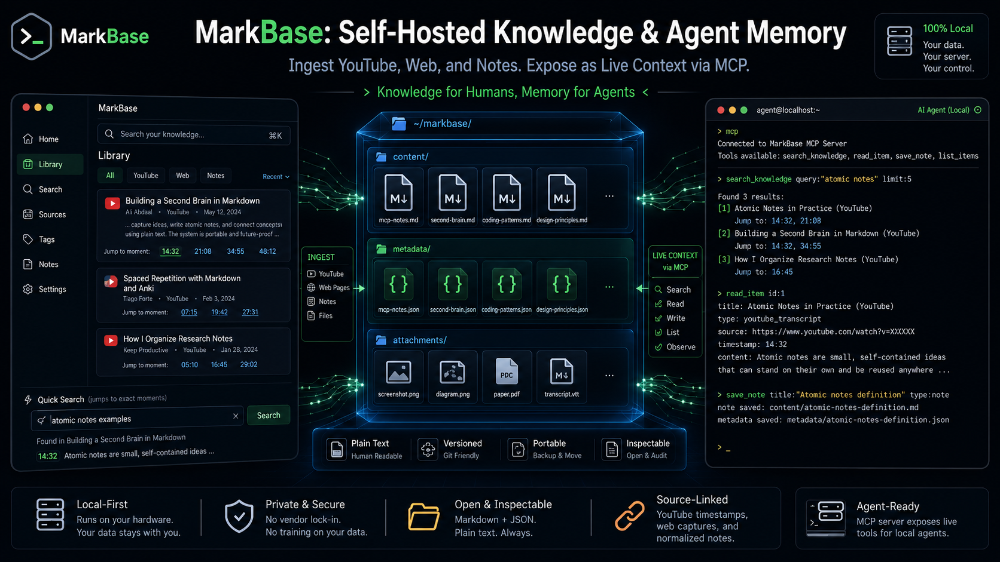

# MarkBase

A self-hosted personal **knowledge ingestion + reading** app.

MarkBase is a two-phase system:

- **Phase 1: Ingestion (deterministic, no AI):** Convert YouTube videos,
  whole YouTube channels, web pages, and uploaded files (PDF, docx, …) into
  clean Markdown using [`yt-dlp`](https://github.com/yt-dlp/yt-dlp) and
  [`markitdown`](https://github.com/microsoft/markitdown).
- **Phase 2: AI enrichment (stubbed):** Summaries and audience-targeted
  rewrites. The schema, API surface, and UI affordances are scaffolded but the
  logic is not yet implemented.

The web UI is both the **ingestion dashboard** and a beautiful **dark-mode
e-reader**. The entire frontend is a single static HTML file, no npm, no
build step, no React.

---

## Features

- Three-panel UI: collapsible library tree · reader · ingestion + metadata.
- Paste a URL: MarkBase auto-detects YouTube video vs. channel vs. web page.
- Upload files for conversion to Markdown.
- SQLite-backed background job queue with live status (and visible failures).
- Markdown rendered with `marked.js`, sanitized with `DOMPurify`, and highlighted with `highlight.js`.
- Client-side metadata filtering + server-side full-text search.
- Inline tag editing, tag filters, keyboard shortcut `⌘/Ctrl+K` to search.

---

## Install

Requires **Python 3.10+**. `markitdown` needs `ffmpeg` available on your PATH
for some media formats.

```bash
git clone <your-fork> markbase && cd markbase
./install.sh
```

The installer **asks where the library should live** (data is kept separate
from this code folder), then creates the virtualenv, installs dependencies,
persists your choice to `~/.config/markbase/markbase.env`, migrates any existing
`./library`, and installs + starts the systemd `--user` service.

Non-interactive / scripted:

```bash
./install.sh --library /srv/markbase --yes
# keep the SQLite queue local while the library lives on a network mount:
./install.sh --library /mnt/nas/markbase --state ~/.local/state/markbase --yes
```

To change the location later, edit `~/.config/markbase/markbase.env` (or re-run
`./install.sh`) and `systemctl --user restart markbase`.

## Run (without the service)

For local development you can run it directly. `start.sh` reads the same
config file, falls back to `./library`, resolves a brokered port, and binds to
LAN (`0.0.0.0`) by default:

```bash
./start.sh                                  # creates venv, installs, launches
MARKBASE_LIBRARY_PATH=/tmp/lib ./start.sh   # ad-hoc library location
PORT=$(portbroker alloc --name markbase-raw --host 0.0.0.0) \
  uvicorn app:app --reload --host 0.0.0.0 --port "$PORT"
```

---

## The library folder

All content lives under a single library directory:

```
library/
  index.json                 # master index (rebuilt from scratch on each change)
  jobs.db                    # SQLite job queue
  youtube/
    @channelname/
      channel.json
      videos/
        video-slug/
          transcript.md
          metadata.json
  docs/
    item-slug/
      content.md
      metadata.json
```

The library lives **outside this code folder**. Its location is chosen by the
installer and stored in `~/.config/markbase/markbase.env`; at runtime it is read
from the `MARKBASE_LIBRARY_PATH` environment variable (fallback: `./library`).
There are **no hardcoded paths**.

```bash
# Re-run the installer to pick a new location (it migrates your data):
./install.sh --library /data/my-knowledge-base

# Or set it ad-hoc:
MARKBASE_LIBRARY_PATH=~/markbase-data ./start.sh
```

On startup MarkBase walks the folder, rebuilds `index.json`, and serves
whatever it finds, so you can drop in an existing library and it just works.

### Network locations

Because items are tiny (Markdown + JSON), the library can live on a network
mount (NFS/SMB). SQLite, used for the job queue (`jobs.db`), is unreliable
over NFS, so keep that operational state local with `MARKBASE_STATE_PATH`:

```bash
./install.sh --library /mnt/nas/markbase --state ~/.local/state/markbase
```

`jobs.db` then stays on local disk while all content syncs from the network
share.

---

## API

| Method | Endpoint                | Purpose                                            |
|--------|-------------------------|----------------------------------------------------|
| GET    | `/`                     | Serve the frontend                                 |
| GET    | `/whoami`              | Service identity/port metadata                     |
| GET    | `/api/library`          | Full `index.json` for the sidebar                  |
| GET    | `/api/item/{path}`      | Metadata + rendered Markdown for an item           |
| DELETE | `/api/item/{path}`      | Delete an item (to `_trash`; `?permanent=true` to purge) |
| GET    | `/api/trash`            | List trashed items (for the Trash view)            |
| POST   | `/api/trash/{name}/restore` | Restore a trashed item to its original location |
| DELETE | `/api/trash/{name}`     | Permanently delete one trashed item                |
| POST   | `/api/trash/empty`      | Permanently purge everything in `_trash`           |
| POST   | `/api/ingest`           | Submit a `url` (form field) or `file` (upload)     |
| POST   | `/api/note`             | Save a hand-authored Markdown note                 |
| GET    | `/api/queue`            | Current job queue status                           |
| GET    | `/api/search?q=`        | Full-text search across metadata + content         |
| POST   | `/api/tag`              | Add/remove/replace tags on an item                 |
| GET    | `/api/channel/{handle}` | All videos for a channel                           |

---

## Design notes / guarantees

- **Atomic writes.** Every file is written to a temp file, `fsync`'d, then
`os.replace`'d into place, no half-written `index.json` or metadata.
- **Index is rebuilt, never appended.** `update_index()` walks the tree from
  scratch, so the index can never drift from what's on disk. Reads go through
  `get_index()`, which serves a cached copy and only rebuilds when a cheap
filesystem fingerprint (per-item path + mtime + size, stat-only) changes, 
  so unchanged page loads don't re-parse every `metadata.json`, but editing or
  deleting files directly on disk is still picked up automatically.
- **Delete is soft by default.** Deleting moves an item to `library/_trash/`
  with a `.trash_meta.json` restore manifest; the **Trash view** (sidebar,
  bottom-left) lists deleted items with **Restore** and **Delete forever**.
  Trashed items are auto-purged after **30 days** (on startup). Internal dirs
  (`_trash`, `_uploads`) are never indexed or searched. Emptied parent folders
  (e.g. a channel with no remaining videos) are pruned automatically.
- **Deterministic, collision-safe slugs.** Titles → `lowercase-hyphenated`;
  collisions get `-2`, `-3`, … suffixes based on existing folders.
- **Graceful failures.** Jobs that fail are marked `failed` with the error
  message stored and shown in the UI; the worker never dies.
- **Single-threaded worker** processes one job at a time; channel ingestion
  fans out into individual per-video jobs.
- **Reliable YouTube transcripts.** Captions are fetched with `yt-dlp`
  (preferring human subtitles over auto-generated), with the VTT reflowed into
readable paragraphs. markitdown is only a fallback, its caption fetch is
  rate-limited by YouTube and fails intermittently, which is what produced the
  earlier "no element found / © Google LLC" junk transcripts.

---

## Running as a persistent service (systemd --user)

On the homeserver MarkBase runs as a user service that resolves its port from
portbroker and starts uvicorn from the project venv:

```bash
systemctl --user enable --now markbase.service   # start + run on boot (linger)
systemctl --user status markbase                 # health
systemctl --user restart markbase                # after code changes
journalctl --user -u markbase -f                 # live logs
```

The unit (`~/.config/systemd/user/markbase.service`) runs `run-service.sh`,
which does `portbroker get --name markbase` (or allocates it once) for a stable port, exports `/whoami` host/port metadata, and execs
`.venv/bin/uvicorn`. Running from the venv ensures `yt-dlp` and `markitdown`
are on `PATH`.

---

## Phase 2, manual knowledge layer (not auto-AI)

Instead of auto-summarization, MarkBase Phase 2 is a **user-controlled**
knowledge layer:

- **Now:** the **Save to MarkBase** panel writes hand-authored Markdown notes
  (snippets, research findings, code explanations, links) as first-class items
  under `library/notes/`. Backed by `ingest.save_note()` → `POST /api/note`.
- **Next (the killer feature):** expose MarkBase as an **MCP server** so any CLI
coding agent (Claude Code, Codex) can (as a tool/skill) **save** to the
  library and **query** it for context mid-session ("what do I already know
  about X"), with no copy/paste. The note write path and `GET /api/search` are
  the surfaces that server will wrap.

`metadata.json` still carries an `ai_status` field (always `"none"` for now),
reserved for future per-item enrichment state.
